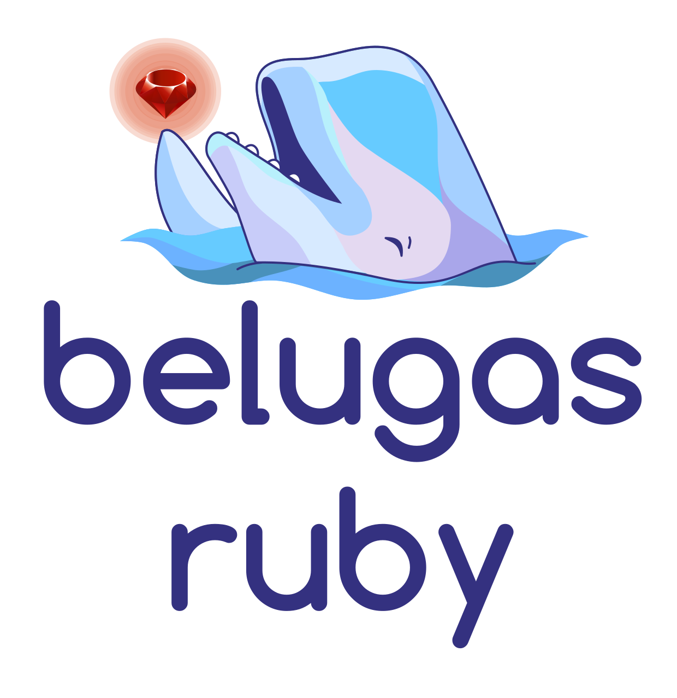

[](https://codeclimate.com/github/WhalesIL/belugas-ruby)
[](https://travis-ci.org/WhalesIL/belugas-ruby)

<p align="center">
  
</p>

## Overview

`belugas-ruby` is an engine for detecting application [features](#what-is-a-feature) for Ruby projects based on static analysis, in other words `belugas-ruby` engine can detect the language, framework, database & dependencies your Ruby application is using.

This engine works as command line interface on your local machine of a Docker container:

<p align="center">
  
</p>

## Table of contents

- [Why?](#why)
- [What is a feature?](#what-is-a-feature)
- [Installation](#installation)
- [Usage](#usage)
- [Contributing](#contributing)
- [Credits](#credits)

## Why?

`belugas-ruby` is part of the [Whales](https://github.com/whalesli/whales) ecosystem: A set of tools to automatically dockerize your applications.

## What is a feature?

A feature is an application attribute detected during the static analysis. This analysis is the act of derivating data from code such as programming language, frameworks, service dependencies and so on. See [here](#supported-features) for a list of attributes this engine currently supports.

A feature has the following format:

```
{
  "type":"feature",
  "name":"Ruby",
  "version":"2.4",
  "description":"The application uses Ruby code",
  "content":"",
  "categories":["Language"],
  "cue_locations":[""],
  "engines":["belugas","belugas-ruby"]
}
```

Where:

- **type**: Will always be a _feature_.
- **name**: This is the name of the language, framework or database that is being used in the application. 
- **version**: The detected version of the feature. This one is optional
- **description**: A string explaining the feature that was detected.
- **content**: A markdown snippet describing the feature, including deeper explanations and links to other resources. This one is optional
- **categories**: Features are associated with one or more of the following categories: Language, Framework, Database, Library & Service.
- **cue_locations**: An array of Location objects representing the places in the source code that provide evidence of the detected feature. This one is optional
- **engines**: An array of engine names that detected the feature, or refined the data detected by the previous engines.

### Supported Features

Currently `belugas-ruby` can detect the following frameworks, databases, libraries and services:

Frameworks:

- Rails
- Sinatra
- Middleman

Databases:

- MySQL
- PostgreSQL
- Mongoid

Libraries & Services:

- Webkit
- Rmagick
- Sidekiq


## Installation

### Prerequisites

The Belugas Ruby CLI is distributed and run as a [Docker](https://hub.docker.com/r/whalesli/belugas-ruby/) image, so you only need to have Docker [installed](https://docs.docker.com/engine/installation/) and running on your machine.

### Setup

Fire up your terminal and run: 

```console
docker pull whalesil/belugas-ruby:latest
```

And that's it! 

## Usage

Here's where the magic begins, first of all in your terminal go to the project directory you want to analyze:

```console
cd code/path_to_project/
```

And then just execute the following command:

```console
docker run \
  --interactive --tty --rm \
  --volume "$PWD":/code \
  whalesil/belugas-ruby
```

And voilá! The terminal will stream a json output for each of the features detected in the following format: 

```
{
  "type":"feature",
  "name":"Ruby",
  "version":"2.3.1",
  "description":"The application uses Ruby code",
  "categories":["Language"],
  "engines":["belugas","belugas-ruby"]
}
{
  "type":"feature",
  "name":"rails",
  "version":"4.2.6",
  "description":"The application uses rails",
  "content":"",
  "categories":["Framework"],
  "cue_locations":[""],
  "engines":["belugas","belugas-ruby"]
}
{
  "type":"feature",
  "name":"postgresql",
  "version":"9.5.6",
  "description":"The application uses postgresql",
  "content":"",
  "categories":["Database"],
  "cue_locations":[""],
  "engines":["belugas","belugas-ruby"]
}
{
  "type":"feature",
  "name":"sidekiq",
  "version":"0",
  "description":"The application uses sidekiq",
  "content":"",
  "categories":["Service"],
  "cue_locations":[""],
  "engines":["belugas","belugas-ruby"]
}
```

## Contributing

Everyone is freely to collaborate, just make sure you follow our [code of conduct](https://github.com/whalesli/belugas-ruby/blob/master/CODE_OF_CONDUCT.md). Thank you [contributors](https://github.com/whalesli/belugas-ruby/graphs/contributors)!

### Create an Issue

Find a bug and don't know how to fix it? Have trouble following the documentation or have a question about the project? Then by all means, please [create an issue](https://github.com/whalesli/belugas-ruby/issues/new).

Just please make sure you check [existing issues](https://github.com/whalesli/belugas-ruby/issues) to see if what you're running into has been addressed already.

### Submit a Pull Request

That's great! Just follow this steps:

1. Create a separate branch for your edits
2. Make sure your changes doesn't break the project by running your changes against current specs. **We love tests!** so it'll be even better if you create new ones when needed
3. Open your pull request against `master`

Once you've created a pull request, mainteners will chime in to review your proposed changes and to merged it if everything is right :tada:

### I want to contribute but don't know where to start

That's great also! We already have some [open issues](https://github.com/whalesli/belugas-ruby/issues) for you to dive in.

## Copyright

See [LICENSE](https://github.com/whalesli/belugas-ruby/blob/master/LICENSE.txt)


Belugas-Ruby is maintained by [Icalia Labs](http://www.icalialabs.com/team)
